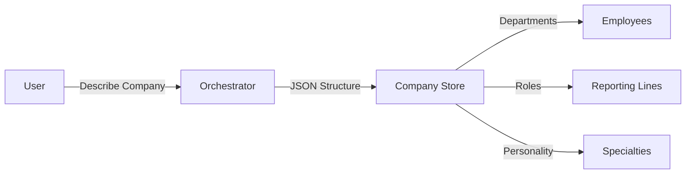
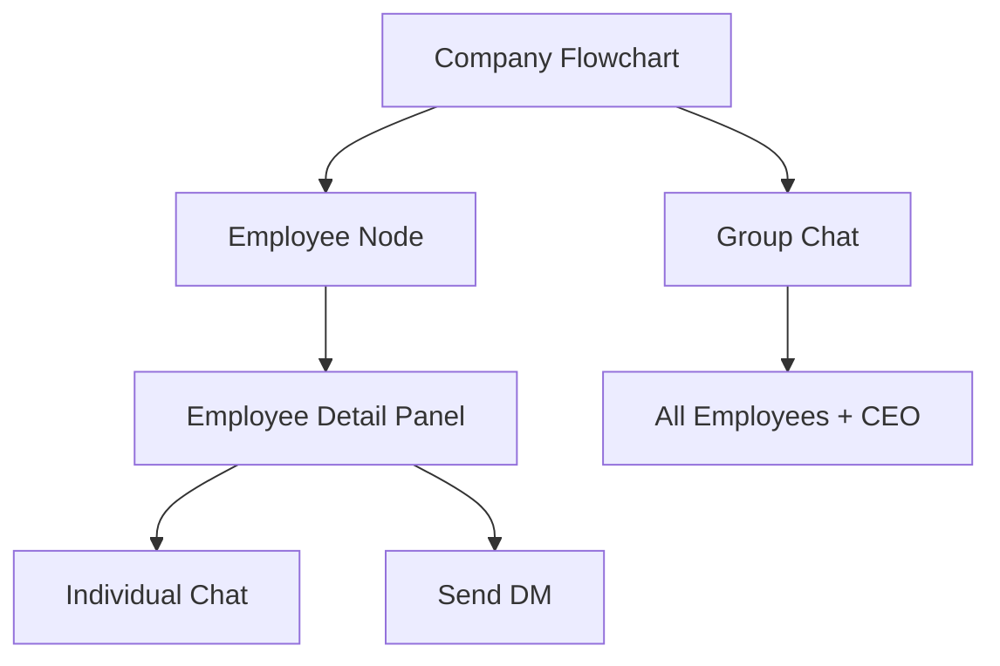

# Chairpeople

<a href="https://github.com/juggperc/Chairpeople"></a>

Build and manage AI-powered companies with autonomous agents. Chairpeople lets you design company structures, assign AI employees with distinct personalities, and watch them collaborate 24/7.

## Features

- **Company Architecture** - Design hierarchical, flat, or any organizational structure you imagine
- **Autonomous Agents** - Each employee is an AI agent with persistent memory and unique personality
- **Multi-Provider Support** - Bring Your Own API key for OpenRouter, OpenCode, or custom providers
- **Real-Time Interaction** - Chat with individual employees, group chats, and DMs between agents
- **Skills & Connectors** - Agents can access external tools and services you define
- **Persistent Memory** - Companies and employees remember context across sessions
- **Visual Organization** - Interactive org chart shows your company structure at a glance

## Tech Stack

<div align="left">


</div>

## Architecture

```
┌─────────────────────────────────────────────────────────────────┐
│                         Chairpeople                               │
├─────────────────────────────────────────────────────────────────┤
│                                                                  │
│  ┌──────────────────┐         ┌────────────────────────────┐ │
│  │   Orchestration   │         │       Interaction            │ │
│  │                  │         │                             │ │
│  │  ┌────────────┐  │         │  ┌────────────┬───────────┐ │ │
│  │  │ Orchestrator │──────┐   │  │  Company    │  Group    │ │ │
│  │  │   Agent    │      │   │  │  │  Flowchart │  Chat     │ │ │
│  │  └────────────┘      │   │  │  └────────────┴───────────┘ │ │
│  │                     │   │   │                             │ │
│  │  Company Builder     │   │   │  ┌─────────┐  ┌─────────┐ │ │
│  │  Editor             │   │   │  │Employee │  │ Direct   │ │ │
│  │                     │   │   │  │ Detail  │  │ Message  │ │ │
│  └─────────────────────┘   │   │  └─────────┘  └─────────┘ │ │
│                            │   └─────────────────────────────┘ │
│                            │                                     │
│                            ▼                                     │
│  ┌────────────────────────────────────────────────────────────┐│
│  │                    Agent Runtime                             ││
│  │  ┌──────────────┐ ┌──────────────┐ ┌──────────────────┐ ││
│  │  │   Memory     │ │    Cron       │ │     Skills       │ ││
│  │  │   Manager    │ │    Jobs       │ │     Registry     │ ││
│  │  └──────────────┘ └──────────────┘ └──────────────────┘ ││
│  └────────────────────────────────────────────────────────────┘│
│                                                                  │
│  ┌────────────────────────────────────────────────────────────┐│
│  │                   SQLite Database                            ││
│  │  companies │ employees │ memory │ skills │ connectors │ cron ││
│  └────────────────────────────────────────────────────────────┘│
└─────────────────────────────────────────────────────────────────┘
```

## Views

### Orchestration View

Design your AI company through conversation with the Orchestrator agent.



### Interaction View

Monitor and collaborate with your AI workforce.



## Getting Started

### Prerequisites

- Node.js 18+
- npm or pnpm
- API keys for OpenRouter, OpenCode, or custom provider

### Installation

```bash
git clone https://github.com/juggperc/Chairpeople.git
cd Chairpeople
npm install
npm run dev
```

### Configuration

1. Open Settings panel
2. Select your AI provider (OpenRouter/OpenCode/Custom)
3. Enter your API key
4. Choose your model
5. Enable web search and configure chunking

## Usage

### Creating a Company

1. Go to **Orchestration** view
2. Describe your desired company structure to the Orchestrator
3. Review the generated structure
4. Click **Create Company**

Example prompts:
- "Build me a tech startup with a flat hierarchy"
- "Create a traditional corporate hierarchy with a CEO and departments"
- "Set up a creative agency with cross-functional teams"

### Interacting with Employees

1. Go to **Interaction** view
2. Click on any employee in the org chart
3. Chat directly or start a DM
4. Join the group chat to observe team discussions

### Building Skills

Ask the Orchestrator to create skills:

- "Let all employees access a central crypto wallet"
- "Enable the sales team to use our Notion workspace"

## Project Structure

```
chairpeople/
├── src/
│   ├── components/
│   │   ├── ai/           # Chat components
│   │   ├── ui/           # Radix UI primitives
│   │   ├── orchestration/ # Company builder
│   │   ├── interaction/   # Flowchart, chat views
│   │   └── layout/       # Sidebar, header
│   ├── lib/
│   │   ├── ai/           # AI provider & agents
│   │   ├── db/           # SQLite schema
│   │   ├── memory/       # Chunked memory
│   │   ├── skills/       # Skill registry
│   │   └── cron/         # Job scheduler
│   ├── stores/           # Zustand state
│   └── types/            # TypeScript types
└── public/
    └── chairpeople.png   # App logo
```

## License

MIT

## Contributing

Contributions welcome! Open an issue or submit a PR.
