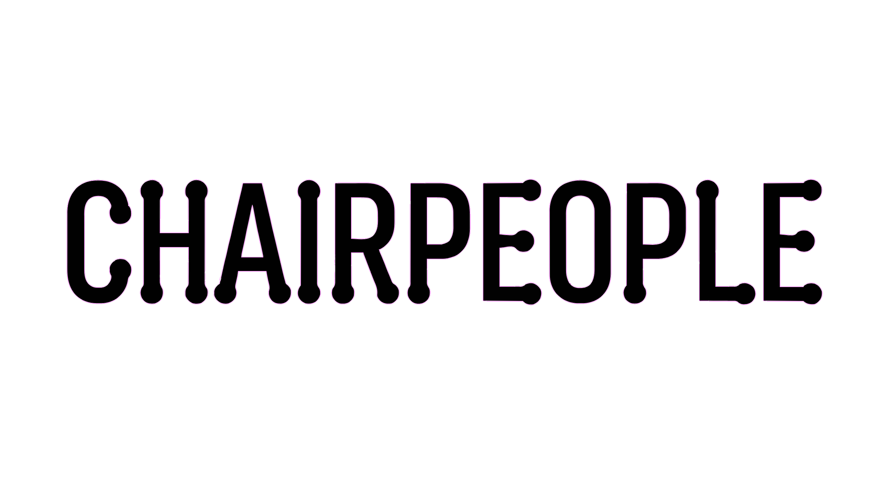
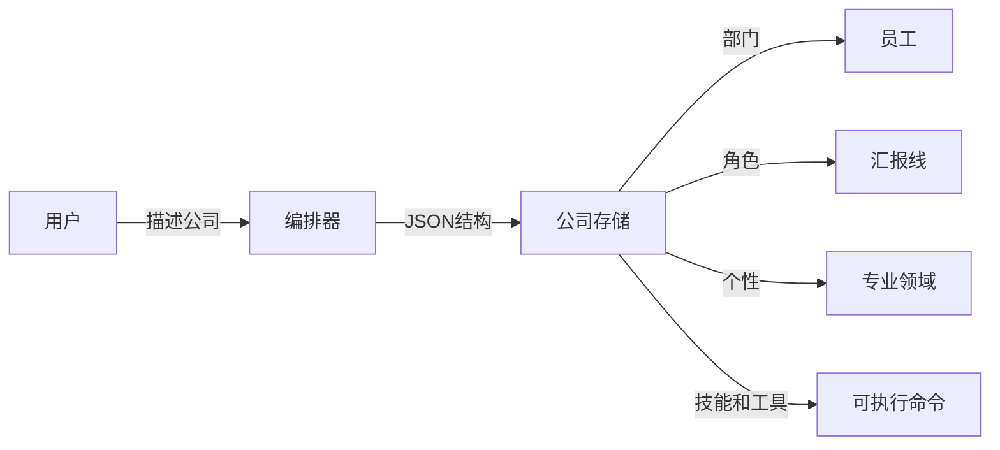
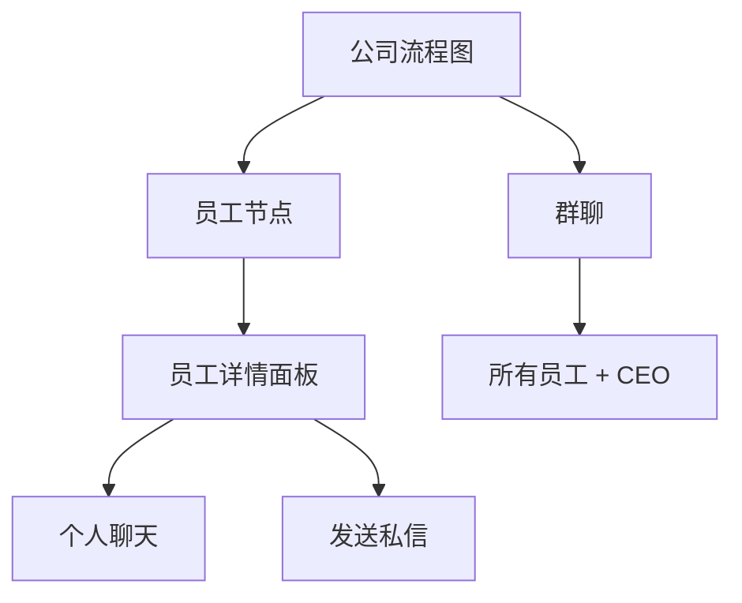

# Chairpeople

<a href="https://github.com/juggperc/Chairpeople"></a>

**[English](./README.md)** | 中文

使用自主智能体构建和管理 AI 驱动的公司。Chairpeople 让您设计公司结构、分配具有独特个性的 AI 员工，并观察他们全天候协作。

## 功能特点

- **公司架构** - 设计您能想象的分层、扁平或任何组织结构
- **自主智能体** - 每个员工都是具有持久记忆和独特个性的 AI 智能体
- **多提供商支持** - 使用 OpenRouter、OpenCode 或自定义提供商的 API 密钥
- **实时流式传输** - 所有聊天视图中 AI 智能体逐 token 流式响应
- **实时交互** - 与个人员工聊天、群聊和智能体之间的私信
- **可执行技能与工具** - 智能体可以在沙盒环境中执行命令
- **技能与连接器** - 编排器可以按需构建和设计自己的技能和连接
- **持久记忆** - 公司和员工跨会话记住上下文
- **可视化组织** - 基于 React Flow 的交互式组织结构图
- **动画 UI** - 全程流畅的 Framer Motion 动画
- **错误处理** - API 密钥缺失或请求失败时显示清晰的错误消息

## 技术栈

<div align="left">


</div>

## 架构

```
┌─────────────────────────────────────────────────────────────────┐
│                         Chairpeople                               │
├─────────────────────────────────────────────────────────────────┤
│                                                                  │
│  ┌──────────────────┐         ┌────────────────────────────┐ │
│  │   编排视图        │         │       交互视图              │ │
│  │                  │         │                             │ │
│  │  ┌────────────┐  │         │  ┌────────────┬───────────┐ │ │
│  │  │ 编排器     │──────┐   │  │  公司      │  群聊     │ │ │
│  │  │   智能体   │      │   │  │  │ 流程图    │           │ │ │
│  │  └────────────┘      │   │  │  └────────────┴───────────┘ │ │
│  │                     │   │   │                             │ │
│  │  公司构建器          │   │   │  ┌─────────┐  ┌─────────┐ │ │
│  │  编辑器             │   │   │  │员工详情 │  │ 私信    │ │ │
│  │                     │   │   │  └─────────┘  └─────────┘ │ │
│  └─────────────────────┘   │   └─────────────────────────────┘ │
│                            │                                     │
│                            ▼                                     │
│  ┌────────────────────────────────────────────────────────────┐│
│  │                    智能体运行时                              ││
│  │  ┌──────────────┐ ┌──────────────┐ ┌──────────────────┐ ││
│  │  │   记忆       │ │    定时      │ │     技能       │ ││
│  │  │   管理器     │ │    任务      │ │   & 工具       │ ││
│  │  └──────────────┘ └──────────────┘ └──────────────────┘ ││
│  └────────────────────────────────────────────────────────────┘│
│                                                                  │
│  ┌────────────────────────────────────────────────────────────┐│
│  │                   SQLite 数据库                               ││
│  │  companies │ employees │ memory │ skills │ connectors │ cron ││
│  └────────────────────────────────────────────────────────────┘│
└─────────────────────────────────────────────────────────────────┘
```

## 视图

### 编排视图

通过与编排器智能体对话来设计您的 AI 公司。



### 交互视图

监控并与您的 AI 团队协作。



## 开始使用

### 前置要求

- Node.js 18+
- npm 或 pnpm
- OpenRouter、OpenCode 或自定义提供商的 API 密钥

### 安装

```bash
git clone https://github.com/juggperc/Chairpeople.git
cd Chairpeople
npm install
npm run dev
```

### 配置

1. 打开设置面板
2. 选择您的 AI 提供商 (OpenRouter/OpenCode/自定义)
3. 输入您的 API 密钥
4. 选择您的模型
5. 启用网络搜索并配置分块

## 使用方法

### 创建公司

1. 进入**编排**视图
2. 向编排器描述您期望的公司结构
3. 审查生成的结构
4. 点击**创建公司**

示例提示：
- "建立一个扁平化结构的科技初创公司"
- "创建一个有 CEO 和部门传统公司结构"
- "建立一个跨职能团队创意代理机构"

### 与员工互动

1. 进入**交互**视图
2. 点击组织结构图中的任何员工
3. 直接聊天或开始私信
4. 加入群聊观察团队讨论

### 构建技能和工具

让编排器创建带有可执行工具的技能：

- "让所有员工访问中央加密货币钱包"
- "启用销售团队使用我们的 Notion 工作区"
- "创建一个允许员工在沙盒中执行命令的工具"

技能可以包括在沙盒环境中安全执行命令的工具。

### 技能和工具系统

编排器可以构建包含以下内容的技能：

- **可执行工具** - 在沙盒中运行的命令
- **参数定义** - 工具的类型化输入
- **描述** - 何时以及如何使用每个工具

示例技能结构：
```json
{
  "name": "crypto_wallet",
  "description": "访问公司加密货币钱包",
  "tools": [
    {
      "name": "get_balance",
      "description": "获取钱包余额",
      "parameters": {
        "address": { "type": "string", "description": "钱包地址", "required": true }
      }
    }
  ]
}
```

## 项目结构

```
chairpeople/
├── src/
│   ├── components/
│   │   ├── ai/           # 聊天组件
│   │   ├── ui/           # Radix UI 原语
│   │   ├── orchestration/ # 公司构建器
│   │   ├── interaction/  # 流程图、聊天视图
│   │   └── layout/      # 侧边栏、标题
│   ├── lib/
│   │   ├── ai/           # AI 提供商和智能体
│   │   ├── db/           # SQLite 模式
│   │   ├── memory/       # 分块记忆
│   │   ├── skills/       # 技能注册表
│   │   ├── tools/        # 工具注册表和沙盒
│   │   └── cron/         # 任务调度器
│   ├── stores/           # Zustand 状态
│   └── types/            # TypeScript 类型
└── public/
    └── chairpeople.png   # 应用标志
```

## 更新日志

### v0.1.1 — 流式传输与交互修复

- **修复**: AI 流式传输现在在所有聊天视图中正常工作（编排、私信、群聊、员工详情）
- **修复**: 不再向 API 发送重复消息
- **修复**: 聊天输入框的 Enter 键提交
- **修复**: AI 响应生成期间加载动画现在可见
- **修复**: 自动滚动现在跟随新消息流式传入
- **修复**: 员工详情内联聊天现在触发 AI 响应
- **修复**: 群聊现在有 AI 员工的流式响应
- **修复**: 员工数据不可用时私信不再崩溃
- **新增**: 错误横幅在 API 密钥缺失或请求失败时显示清晰消息
- **新增**: 多行 AI 响应正确渲染并保留空白格式
- **清理**: 移除未使用的浏览器端 AI SDK 导入

### v0.1.0 — 初始发布

- 编排视图与公司结构生成
- 交互视图与组织结构图、私信和群聊
- 多提供商支持（OpenRouter、OpenCode、自定义）
- 技能与工具系统及沙盒执行
- 持久记忆和定时任务调度
- SQLite 数据库用于所有数据持久化

## 许可证

MIT

## 贡献

欢迎贡献！请提交 issue 或 PR。
